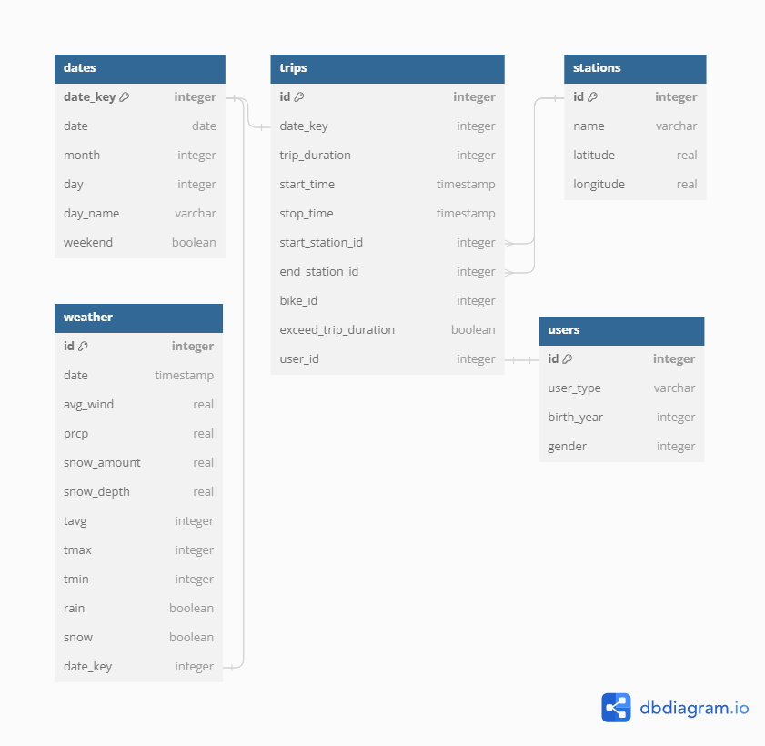

# Project Description
This project creates a PostgreSQL database with analtycis-ready views connecting bike rental and weather datasets. This project involves:
- exploring and clenaing both datasets
- developing a relational database schema
- implementing the database in PostgresQL and inserting the datasets
- creating analytics-ready views 

## Scenario
A bike rental company wants a database for their analysts to understand the effects of weather on bike rentals. This database will contain a year of bike rental data provided by the company as well as the weather data sourced from the airport. As a data engineer, my goal is to clean and validate both data sets, design a relational PostgreSQL database, and develop views for the database to assist the analytics team. 

# Process

## Data Exploration & Transformation - [Writeup in Jupyter Notebook](https://github.com/SereniT33/Codecademy_DE_Portfolio/blob/main/bike-rental-data-management/bike-rental.ipynb)

The raw bike rental dataset has gone through the following transformations:
- Updating column names and data types;
- Identifying and romoving an outlier in the birth year column;
- Creating a column to flag riders whose trip exceeded 24 hours;
- Adding 'unkown' category for missing data in the user type column;
- Noting null values in the birth year and gender may be structually missing.

The raw weather data has gone through the following transformations: 
- Dropping columns without info. useful for the analysis;
- Updating columns names and data types;
- Adding binary columns for rain and snow;

## Developing a Relational Database 
A PostgreSQL Database is created using Postbird and updated on the Jupyter notebook. Total five PostgreSQL tables contain the information on:
1. Dates;
2. Trips;
3. Users;
4. Stations;

### Database Schema

## Developing Views
Finally, the view tables were created to help analysts. 
1. Daily trips: include daily trips in total and depending on the user type;
2. Daily data: include both daily trip data and weather data;
3. Monthly data: include monthly trip data and weather data;
4. Late return: include locational and user information related to trips that lasted over 24 hours.